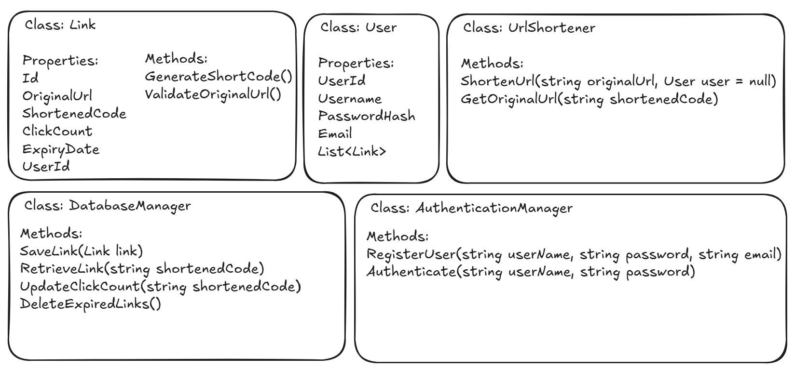

# Project Log

## 2024/Dec/19
- **Current progress:** 
Installed all necessary NuGetPackages.
Created all the necessary folders

- **Next steps:** 
Based on the scope of the project, and with the first draft of the classes done, I decided to start by working on the backend.
- **Blockers:**
None.

## 2024/Dec/18
- **Current progress:** 
Created the GitHub directory.
Added the base of the front and backend.
Defined the scope of the project.
Decided which technologies are going to be used.
Added all the information into a documentation.
Uploaded the documentation and base of the project to GitHub.

Based on the requirements of the project, I design the first draft of the classes needed, as seen below:

- **Next steps:** 
Based on the scope of the project, and with the first draft of the classes done, I decided to start by working on the backend.
- **Blockers:**
None.
